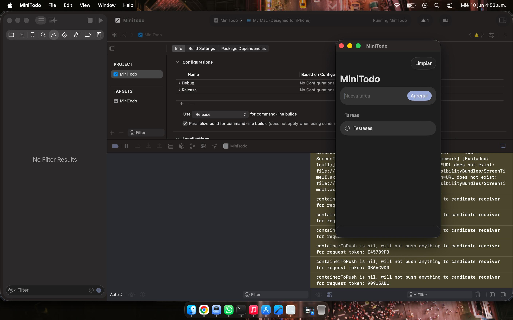

# MiniProjectIos

Este proyecto es solo un test para probar cómo funciona la MacBook Neo al compilar una app Android.

No tiene otro objetivo ni funcionalidad adicional: sirve únicamente para verificar el proceso de compilación y entorno.

Esta es una imagen de la propia app funcionando perfectamente.

